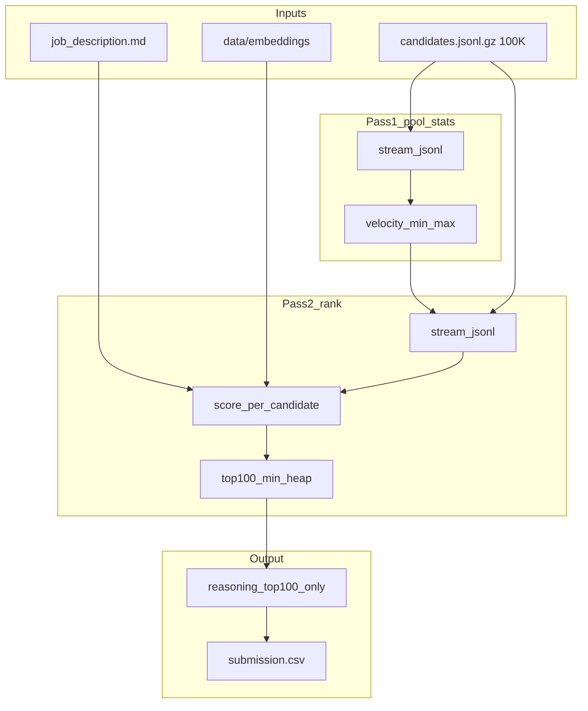
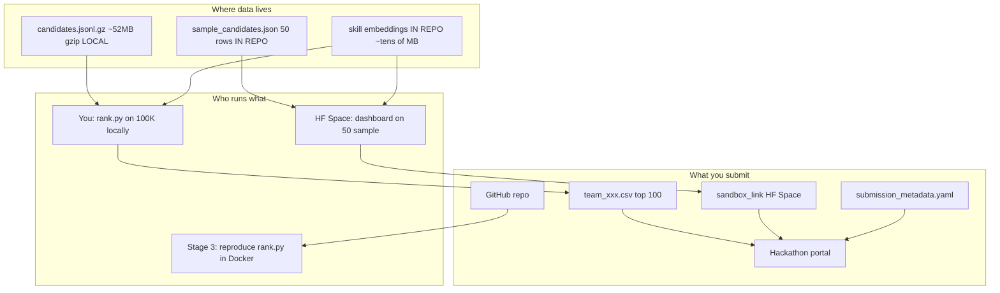

# TalentDNA AI — Execution Plan (Parser-First)

## Current state

- Workspace `[d:\Redrob-Talent-Hire](d:\Redrob-Talent-Hire)` is **empty** (greenfield).
- **Production dataset:** `candidates.jsonl.gz` from participant bundle — **~52 MB gzip / ~465 MB uncompressed**, **exactly 100,000** lines (`wc -l candidates.jsonl` → 100000).
- **Job description:** Senior AI Engineer — Founding Team @ Redrob AI. User has `**job_description.docx`**; commit transcribed `[data/job_description.md](data/job_description.md)` (same content). Parser supports `**.md` (primary)** and `**.docx` (fallback via `python-docx`)**.
- **Bundle docs** to vendor in repo: `submission_spec.md`, `redrob_signals_doc.md`, `candidate_schema.json`, `sample_candidates.json` (50 records), `sample_submission.csv`.
- Field naming: `career_history` → internal `experience_timeline`; `redrob_signals` nested (23 signals — see `redrob_signals_doc.md`).
- Official **submission spec v4** received and locked (CSV format, compute limits, honeypots, reasoning quality, evaluation metrics).
- Product spec aligned: TalentDNA Project Specification v1 merged into this plan (see **Alignment audit**).

## Repository layout (locked)

Use the blueprint structure at repo root (folder name can stay `Redrob-Talent-Hire`; README will brand as TalentDNA):

```text
submission_metadata.yaml          # from submission_metadata_template.yaml
rank.py
validate_submission.py            # CSV format validator (organizer copy)
scripts/
  precompute_embeddings.py
.gitignore                        # data/candidates.jsonl*, data/embeddings/, output/
candidates.jsonl                  # gunzip -k data/candidates.jsonl.gz → here for reproduce_command
docs/                             # bundle reference docs (committed)
  submission_spec.md
  redrob_signals_doc.md
  job_description.md              # canonical JD (also copied/symlinked under data/)
data/
  candidates.jsonl.gz             # ~52MB — LOCAL, not in git (or gunzip -k → candidates.jsonl)
  job_description.md
  sample_candidates.json          # 50 candidates for sandbox / fast dev
  embeddings/                   # precomputed skill vectors + local model snapshot
config/
  candidate_schema.json           # from bundle
  weights.json
src/
  parser.py
  features.py
  scoring.py
  explainability.py
  main.py
sandbox/
  app.py                    # thin launcher → dashboard/
dashboard/
  app.py                    # Streamlit: Talent Opportunity Map + contrast cards
  components/
    opportunity_map.py        # Plotly scatter Current Fit × Future Fit, 4 quadrants
    candidate_card.py         # ATS-failed vs TalentDNA-selected side-by-side
output/
  submission.csv
  analytics.csv
  results.json                # top-100 full metric dump for dashboard

## End-to-end pipeline




---

## Scale architecture (100,000 candidates / ~465 MB)

The ranking step must finish in **≤5 minutes on 16 GB CPU** over the full pool.


| Constraint              | Approach                                                                               |
| ----------------------- | -------------------------------------------------------------------------------------- |
| 100K × ~4.6 KB/line     | **Streaming** `gzip.open` or `open` — never `list(all_candidates)` in `rank.py`        |
| Input formats           | Accept `./candidates.jsonl`, `./candidates.jsonl.gz`, or `gunzip -k` uncompressed copy |
| Pool min-max for `V`    | **Two-pass stream** over same file (~2× read; ~930 MB I/O uncompressed)                |
| Top 100 from 100K       | `**heapq.nlargest(100)`** — O(n log 100)                                               |
| Embeddings at rank time | Precomputed skill lookup only — no `model.encode()`                                    |
| Reasoning               | **Top 100 only**                                                                       |
| Sandbox demo            | `[data/sample_candidates.json](data/sample_candidates.json)` — 50 candidates, no gzip  |


### Streaming parser API (replaces bulk load for ranking)

```python
# src/parser.py — transparent gzip support
def _open_text(path: Path):
    if path.suffix == ".gz" or path.name.endswith(".jsonl.gz"):
        return gzip.open(path, "rt", encoding="utf-8")
    return open(path, "r", encoding="utf-8")

def iter_candidates(path: Path, schema: dict) -> Iterator[CandidateRecord]: ...
def count_candidates(path: Path) -> int: ...  # expect 100000 on full pool
```

### Two-pass ranking flow (`[src/main.py](src/main.py)`)

```
Pass 1: for record in iter_candidates(path):
            v_raw = features.career_velocity_raw(record)
            update running min/max of v_raw

Pass 2: heap = []
        for record in iter_candidates(path):
            scores = scoring.compute(record, v_min, v_max, embedding_lut)
            push (composite, candidate_id, record, scores) into size-100 heap
            tie-break: (-composite, candidate_id) ordering in heap comparator

        top100 = sorted(heap, key=lambda x: (-x.composite, x.candidate_id))
        assign ranks 1..100, scores, reasoning via explainability
        write_submission_csv(...)
```

### Pre-computation (`[scripts/precompute_embeddings.py](scripts/precompute_embeddings.py)`)

Run **once offline** (may exceed 5 min; documented in `submission_metadata.yaml`):

1. Stream entire `candidates.jsonl` → collect **unique skill names** (est. 3K–15K)
2. Encode unique skills + JD required/preferred skills with local `bge-small-en-v1.5`
3. Save `data/embeddings/skill_vectors.npz` (name → float16 vector) + `jd_skill_vectors.npz`
4. Optionally bundle `data/embeddings/model/` for offline `HF_HUB_OFFLINE=1`

**Rank step never calls `model.encode()`** — only dict lookup + numpy dot products.

---

## Unified schemas (parser contract)

`[src/parser.py](src/parser.py)` is the **single source of truth** for normalized structures consumed by all downstream modules. Raw input must conform to the official Redrob candidate schema before normalization.

### Official input schema — `[config/candidate_schema.json](config/candidate_schema.json)`

Ship organizer JSON Schema verbatim. Validate **each JSONL line** on load via `jsonschema` (fail-fast in dev; log-and-skip optional flag for production robustness).

**Top-level required keys:** `candidate_id`, `profile`, `career_history`, `education`, `skills`, `redrob_signals`


| Field                              | Schema constraint                                                              | Parser handling                                                         |
| ---------------------------------- | ------------------------------------------------------------------------------ | ----------------------------------------------------------------------- |
| `candidate_id`                     | `^CAND_[0-9]{7}$`                                                              | Passthrough; reject duplicates across file                              |
| `profile.years_of_experience`      | number 0–50                                                                    | Used in velocity formula                                                |
| `profile.current_company_size`     | enum bucket string                                                             | Passthrough                                                             |
| `career_history`                   | array 1–10 items                                                               | Normalize → internal `experience_timeline`; sort by `start_date` asc    |
| `career_history[].end_date`        | date string or `null`                                                          | `null` = current role                                                   |
| `career_history[].duration_months` | int ≥ 0                                                                        | Used in fracture detection                                              |
| `education`                        | array 0–5 items                                                                | Passthrough; `tier` enum for optional education signal                  |
| `skills[]`                         | objects with `name`, `proficiency`, `endorsements`, optional `duration_months` | `proficiency` enum: `beginner` | `intermediate` | `advanced` | `expert` |
| `certifications`, `languages`      | optional arrays                                                                | Default `[]` if absent                                                  |
| `redrob_signals`                   | 22 required sub-keys                                                           | See sentinel rules below                                                |


**Sentinel values (do not treat as valid rates):**


| Field                   | Sentinel | Normalized use                                                         |
| ----------------------- | -------- | ---------------------------------------------------------------------- |
| `github_activity_score` | `-1`     | No GitHub linked → exclude from confidence; don't mention in reasoning |
| `offer_acceptance_rate` | `-1`     | No offer history → exclude from behavioral averages                    |


**Rates to clamp [0, 1]:** `recruiter_response_rate`, `interview_completion_rate`, `offer_acceptance_rate` (when ≠ -1).

```python
# src/parser.py — load pipeline per JSONL line
raw = json.loads(line)
jsonschema.validate(raw, schema)          # raises on invalid
record = normalize_candidate(raw)         # → CandidateRecord
```

### `JobDescription` — Senior AI Engineer (locked parse targets)

Parser extracts structured fields from prose sections (phrase-delimited, not only `##` markdown). Split off hackathon appendix at **"Final note for the participants"**.


| Field                  | Locked value / rule                                                   |
| ---------------------- | --------------------------------------------------------------------- |
| `title`                | `Senior AI Engineer — Founding Team`                                  |
| `min_experience_years` | **5** (from "5–9 years"; use 5 as floor)                              |
| `max_experience_years` | **9** (soft ceiling — outside band penalized, not hard-cut)           |
| `locations`            | `Pune`, `Noida`, `Hyderabad`, `Mumbai`, `Delhi NCR` (+ India broadly) |
| `employment`           | Hybrid, India-preferred                                               |


`**required_skills` J** (from "Things you absolutely need" — seed `[config/weights.json](config/weights.json)`):

```json
[
  "embeddings", "sentence-transformers", "BGE", "E5", "retrieval",
  "vector database", "Pinecone", "Weaviate", "Qdrant", "Milvus",
  "OpenSearch", "Elasticsearch", "FAISS", "hybrid search",
  "Python", "NDCG", "MRR", "MAP", "ranking evaluation", "A/B testing"
]
```

`**preferred_skills**` (from "Things we'd like you to have"):

```json
[
  "LoRA", "QLoRA", "PEFT", "fine-tuning", "learning to rank", "XGBoost",
  "recruiting", "HR-tech", "marketplace", "distributed systems",
  "open source"
]
```

`**disqualifier_rules**` (from "Things we explicitly do NOT want" + "disqualifiers we actually apply" — applied as penalties in `features.py`, not hard drops):


| Rule ID               | Detection                                                                                                                     | Penalty                              |
| --------------------- | ----------------------------------------------------------------------------------------------------------------------------- | ------------------------------------ |
| `title_chaser`        | ≥3 roles with `duration_months < 18`                                                                                          | +0.15 composite penalty              |
| `consulting_only`     | All `career_history.company` in {TCS, Infosys, Wipro, Accenture, Cognizant, Capgemini, Mindtree} with no product-company role | +0.20                                |
| `role_skill_mismatch` | `current_title` ∉ ML/engineering keywords AND ≥5 "AI core" skills in list                                                     | +0.25 (Marketing Manager + NLP trap) |
| `cv_only`             | Skills heavy in {OpenCV, speech, robotics, GANs} without {NLP, retrieval, embeddings, ranking}                                | +0.10                                |
| `inactive`            | `last_active_date` > 180 days ago OR `recruiter_response_rate < 0.10`                                                         | +0.15 availability penalty           |
| `honeypot`            | Impossible timeline / expert+0mo skills                                                                                       | +0.50 (existing)                     |


`**hackathon_meta**` (from "Final note for the participants" — store separately, **exclude from JD embedding text**):

- Do **not** rank on AI keyword density alone.
- **FutureFit > S_current** when career descriptions mention ranking/search/recommendation at product companies even if skills omit "RAG"/"Pinecone".
- Down-weight high paper-fit / low behavioral availability.
- Marketing Manager + perfect skill list = explicit anti-pattern.

**JD parsing implementation:**

1. Read `.md` as UTF-8 text OR `.docx` via `python-docx` → plain text.
2. Slice at `Final note for the participants` → `ranking_text` vs `hackathon_meta`.
3. Extract bullets under phrase anchors: `Things you absolutely need`, `Things we'd like`, `Things we explicitly do NOT want`.
4. Merge with locked skill seeds in `weights.json` (seeds are authoritative if prose parse is thin).
5. Regex: `Experience Required: (\d+)[–-](\d+) years`, location line.

### `CandidateRecord` (normalized internal model)

Parser reads schema field `career_history` and exposes internal alias `experience_timeline` for blueprint-aligned downstream code.


| Internal field        | Raw JSON field   | Normalization                                                   |
| --------------------- | ---------------- | --------------------------------------------------------------- |
| `candidate_id`        | `candidate_id`   | regex-validated passthrough                                     |
| `profile`             | `profile`        | passthrough (all 10 required sub-fields)                        |
| `experience_timeline` | `career_history` | sort by `start_date`; preserve `industry`, `company_size`       |
| `skills`              | `skills[]`       | `list[str]` of `name`                                           |
| `skill_details`       | `skills[]`       | full objects — `proficiency`, `duration_months`, `endorsements` |
| `redrob_signals`      | `redrob_signals` | clamp rates; map `-1` sentinels to `None`                       |
| `education`           | `education`      | passthrough                                                     |
| `certifications`      | `certifications` | default `[]`                                                    |
| `languages`           | `languages`      | default `[]`                                                    |


`**experience_timeline` entry shape** (from `career_history`):

```python
{
  "company": str,
  "title": str,
  "start_date": "YYYY-MM-DD",
  "end_date": str | None,
  "duration_months": int,
  "is_current": bool,
  "industry": str,
  "company_size": str,          # enum bucket
  "description": str,
}
```

### `Parser` public API

```python
# src/parser.py
def load_job_description(path: Path) -> JobDescription: ...
def load_candidates(path: Path) -> list[CandidateRecord]: ...
def load_weights(path: Path) -> dict: ...
def parse_all(data_dir: Path, config_dir: Path) -> ParsedDataset: ...
```

`ParsedDataset` = `{ job: JobDescription, candidates: list[CandidateRecord], weights: dict }`.

**JSONL loader:** streaming `iter_candidates()` for production; optional `load_candidates(limit=N)` for sandbox/tests. Validate each line with jsonschema; build `valid_ids: set[str]` during pass 1 or dedicated index scan for `rank.py` cross-check.

---

---

## Alignment audit: TalentDNA product spec ↔ hackathon plan

### Aligned (keep as-is)


| Product spec                                  | Plan                                           | Status                     |
| --------------------------------------------- | ---------------------------------------------- | -------------------------- |
| Core insight: current skills ≠ future success | Hidden gem narrative + JD hackathon note       | ✅                          |
| Current Fit = semantic skill match            | `S_current` / Current Fit                      | ✅ merge naming             |
| Career Velocity from title tiers              | `V` / CV sub-metric                            | ✅ same math                |
| Behavioral signals from Redrob                | `redrob_signals` inline per candidate          | ✅ (not separate JSON file) |
| Contrastive explainability                    | "Why ATS failed" reasoning                     | ✅                          |
| Transparent formulas                          | All scores in `analytics.csv` / `results.json` | ✅                          |
| Streamlit demo                                | `dashboard/app.py`                             | ✅ upgraded                 |
| Parser-first Day 1                            | `src/parser.py`                                | ✅                          |


### Reconciled (spec updated to match hackathon reality)


| Product spec says                 | Hackathon reality                           | **Locked resolution**                                                                                        |
| --------------------------------- | ------------------------------------------- | ------------------------------------------------------------------------------------------------------------ |
| `candidates.json`                 | `candidates.jsonl.gz` / `.jsonl`, 100K rows | Use JSONL streaming; product diagram updated                                                                 |
| `redrob_signals.json` separate    | Nested in each candidate                    | Parse from `candidate.redrob_signals`                                                                        |
| `job_description.docx` only       | Bundle `.md` + user `.docx`                 | Parser supports both; same Senior AI Engineer content                                                        |
| Groq/LLM for explainability prose | **No network during `rank.py`**             | **Fact-slot contrast cards** in rank path; optional LLM only in dashboard dev mode (not submission pipeline) |
| `BAAI/bge-small` in early plan    | Spec: `all-MiniLM-L6-v2`                    | **Lock MiniLM** for rank step — faster on 100K CPU, still defensible                                         |
| `feature_engineering.py`          | `features.py`                               | Same module; name `features.py` in repo                                                                      |
| `results.json` output             | Also need `submission.csv`                  | `rank.py` → CSV; `results.json` → dashboard                                                                  |


### Formulas — adopt product spec as canonical (merged with JD penalties)

**Feature 1 — Current Fit** (`S_current`, 0–100):


S_{current} = \frac{1}{|J|}\sum_{j \in J} \max_{c \in C} \cos(V_j, V_c) \times 100


**Feature 2 — Future Fit** (0–100) — **replace prior FutureFit blend**:


| Sub-metric            | Symbol | Formula                                                                                                                                                                       |
| --------------------- | ------ | ----------------------------------------------------------------------------------------------------------------------------------------------------------------------------- |
| Skill Transferability | ST     | For each required j \in J where j \notin C: \max_{c \in C} \cos(V_j, V_c); average × 100. If candidate has j, treat similarity as 1.0 for that slot.                          |
| Adaptability          | AS     | Chronological parse of `experience_timeline.description`; count distinct tech/tool tokens appearing in last 36 months not in earlier roles; scale 0–100 via pool max (pass-1) |
| Career Velocity       | CV     | (W_{recent} - W_{earliest}) / years; pool min-max → 0–100                                                                                                                     |


FutureFit = 0.40 \cdot ST + 0.30 \cdot AS_{norm} + 0.30 \cdot CV_{norm}


**Feature 3 — Hidden Gem** (0–100 display):


ATSMiss = \max(0,\ FutureFit - S_{current})


G = \frac{FutureFit \times Confidence \times ATSMiss}{100}


(Confidence 0–100 from profile completeness, timeline depth, assessments, signals — not a constant.)

**Feature 4 — Interview Opportunity Index** (0–100):


Opportunity = \frac{FutureFit \times recruiterresponserate \times interviewcompletionrate}{100}


(sentinel `-1` rates excluded)

**Feature 5 — Hiring Risk** (kept from plan; spec listed optional):

R = timeline fractures + behavioral friction (unchanged). Used as penalty, not headline metric.

**Final rank composite** (balances NDCG@10 + product uniqueness):

```
composite = 0.22 * S_current_norm
          + 0.28 * FutureFit_norm
          + 0.20 * G_norm
          + 0.12 * Opportunity_norm
          + 0.08 * Confidence_norm
          + 0.05 * LocationFit_norm
          + 0.05 * ExperienceBand_norm
          - 0.12 * R_norm
          - disqualifier_penalty_sum
          - 0.50 * honeypot_penalty
```

**Onboarding window** (explainability / card): high ST → `"2 weeks"`; medium ST → `"4–6 weeks"`; low → `"8+ weeks"`.

### Explainability — "Why ATS Failed / Why TalentDNA Selected"

Structured contrast (no LLM in `rank.py`):

```
ATS_FAILED:
  - Missing: [top 2-3 J_core skills not in C_skills]
  - Keyword filter would score: ~{S_current}%

TALENTDNA_SELECTED:
  - Adjacent: [top ST matches, e.g. Docker/Helm for missing Kubernetes]
  - Adaptability: {AS_count} new technologies in 36 months
  - Future Fit: {FutureFit}% vs Current Fit: {S_current}%
```

Submission `reasoning` column = 1–2 sentence compression of this contrast (fact-slot, varied openers).

### Feature 6 — Talent Opportunity Map (demo differentiator)

`**dashboard/components/opportunity_map.py**` — Plotly scatter:

- X = Current Fit, Y = Future Fit (top 100 or sample 500 for perf)
- Quadrants: Safe Hires | **Hidden Gems** | Overrated | Unaligned
- Color by quadrant; click → `candidate_card.py` with full contrast panel
- Dark theme, Redrob branding — **this is the "wow" slide replacement**

### What makes us unique vs other teams

1. **Dual-score story** with visible quadrant map (not single match %)
2. **ATS_Miss-driven Hidden Gem** formula (product spec — mathematically distinct)
3. **Adaptability Score** from timeline text (not just embeddings)
4. **Contrastive reasoning** in CSV + dashboard (Stage 4 + demo)
5. **JD-aware trap handling** (consulting-only, role/skill mismatch) — other teams will keyword-match into traps

### Implementation order (merged spec + hackathon)


| Day | Deliverable                                                         |
| --- | ------------------------------------------------------------------- |
| 1   | `parser.py` + pydantic models + JD seeds + gzip JSONL               |
| 1–2 | Current Fit pipeline + precompute skill embeddings                  |
| 3   | ST, AS, CV in `features.py`                                         |
| 4   | Future Fit, Hidden Gem, Opportunity, composite, `rank.py` → CSV     |
| 5   | JD disqualifiers, honeypots, validator gate                         |
| 6   | Explainability contrast cards → `reasoning` column + `results.json` |
| 7   | **Streamlit dashboard** — Opportunity Map + cards (HF Space)        |
| 8   | README, demo script, PPT hooks, full 100K reproduce test            |


---

## Locked formulas (canonical — see alignment section above)

### A. Current Fit — `S_current` (= product **Current Fit**)

- Model: `**all-MiniLM-L6-v2`** (locked for 100K CPU budget; precomputed skill vectors).
- J = `job.required_skills`, C = `candidate.skills`.
- S_{current} = \frac{1}{|J|} \sum_{j \in J} \max_{c \in C} \cos(V_j, V_c) \times 100
- Edge: if |J| = 0, use embedding similarity between full JD text and candidate headline+summary.

### B. Future Fit sub-metrics — ST, AS, CV

**ST (Skill Transferability):** see alignment section.

**AS (Adaptability):** extract tech tokens from `experience_timeline[].description` by date; count new-in-last-36-months; normalize pass-1.

**CV (Career Velocity):** title tiers (unchanged):

```json
"title_weights": {
  "junior": 1, "associate": 1, "mid": 2, "se_ii": 2,
  "senior": 3, "lead": 4, "principal": 4
}
```

- Match title tokens case-insensitively; default weight **2** if unmatched.
- Raw: V_{raw} = \frac{W_{recent} - W_{earliest}}{\text{yearsofexperience}} (guard div-by-zero → 0).
- Pool scaling: min-max → 0–100 on full streamed pool.


FutureFit = 0.40 \cdot ST + 0.30 \cdot AS_{norm} + 0.30 \cdot CV_{norm}


### C. Hiring Risk — `R`

- **Timeline fractures** on `experience_timeline`:
  - `duration_months < 12` → **+20** each
  - gap between consecutive roles `> 6` months → **+15** each (use `end_date` → next `start_date`)
- **Behavioral** (from `redrob_signals`):
  - R = \text{fractures} + (1 - \text{recruiterresponserate}) \times 30 + (1 - \text{interviewcompletionrate}) \times 35
- Clamp **0–100**.

### D. Hidden Gem — `G`


ATSMiss = \max(0,\ FutureFit - S_{current}),\quad G = \frac{FutureFit \times Confidence \times ATSMiss}{100}


**Confidence** (0–100): profile completeness (20%), timeline depth / role count (15%), skill assessments (20%), `recruiter_response_rate` (20%), `last_active` recency (15%), `open_to_work` (10%).

### E. Interview Opportunity Index


Opportunity = \frac{FutureFit \times recruiterresponserate \times interviewcompletionrate}{100}


### F. Dashboard card fields


| Metric            | Formula                                                                            |
| ----------------- | ---------------------------------------------------------------------------------- |
| Onboarding Window | ST high → `2 weeks`; medium → `4–6 weeks`; low → `8+ weeks`                        |
| STATUS            | `HIDDEN GEM` if `G > 40` and `S_current < 60` and `FutureFit > 70`                 |
| Quadrant          | Safe Hire / Hidden Gem / Overrated / Unaligned from (S_current, FutureFit) medians |


### G. Final ranking composite

See **Alignment audit** section for full coefficients (includes Opportunity Index).

- All `_norm` values scaled 0–1 within candidate pool.
- **Sort key (matches organizer validator):** `(-composite, candidate_id)` — higher composite first; on tie, lexicographically ascending `candidate_id` gets the lower rank number.
- Take **top 100** rows only.
- **CSV `score`:** assign from composite (e.g. min-max to `(0, 1]`). Equal composites → equal float scores. When `score[r] == score[r+1]`, validator requires `candidate_id[r] < candidate_id[r+1]`.

```python
ranked = sorted(candidates, key=lambda c: (-c.composite, c.candidate_id))[:100]
```

### H. Trap candidates (per bundle + `redrob_signals_doc.md`)

Dataset contains **four trap classes** beyond random noise:


| Trap type                  | Detection signal                                                  | Ranker response                                         |
| -------------------------- | ----------------------------------------------------------------- | ------------------------------------------------------- |
| **Honeypots** (~80)        | Impossible timelines, expert skills + 0 months, tenure math       | `honeypot_penalty = 1.0`                                |
| **Keyword stuffers**       | High skill count, low `duration_months` avg, weak assessments     | Low `Confidence`; endorsement-duration trust factor     |
| **Plain-language Tier 5s** | `education.tier` = tier_4/5, generic summary, weak JD skill match | Low `S_current`; do not rank on headline keywords alone |
| **Behavioral twins**       | Identical `redrob_signals` envelopes across different IDs         | Secondary dedup signal; don't boost on signals alone    |


Stage 3: **>10% honeypots in top 100 → disqualified**. Read `[docs/redrob_signals_doc.md](docs/redrob_signals_doc.md)` for signal envelopes.

---

## Tech stack (product spec + hackathon)


| Layer          | Tool                                                                  |
| -------------- | --------------------------------------------------------------------- |
| Embeddings     | `sentence-transformers` **all-MiniLM-L6-v2**                          |
| Data models    | **pydantic** v2 (`CandidateRecord`, `JobDescription`, `ScoreBundle`)  |
| Parsing        | `python-docx`, `jsonschema`, streaming `gzip`                         |
| Scoring        | numpy/pandas; streaming on 100K pool                                  |
| Explainability | Fact-slot contrast (**no LLM in `rank.py`** — hackathon compute rule) |
| Dashboard      | **Streamlit + Plotly** — Talent Opportunity Map                       |
| Outputs        | `submission.csv` + `output/results.json`                              |


## `[config/weights.json](config/weights.json)` (initial skeleton)

- `embedding_model`, `title_weights`, `risk_weights` (20, 15, 30, 35)
- `hidden_gem_threshold`, `future_fit_weights`, `confidence_weights`
- `skill_clusters` — **JD-specific** (see below)
- `jd_skill_seeds` — locked required/preferred lists above
- `disqualifier_rules` — consulting firms list, ML title keywords, inactive thresholds
- `consulting_firms` — TCS, Infosys, Wipro, Accenture, Cognizant, Capgemini, Mindtree

**Skill clusters for FutureFit adjacency:**

```json
"skill_clusters": {
  "embeddings_retrieval": ["embeddings", "sentence-transformers", "BGE", "E5", "OpenAI embeddings", "dense retrieval", "hybrid retrieval"],
  "vector_infra": ["FAISS", "Milvus", "Pinecone", "Weaviate", "Qdrant", "OpenSearch", "Elasticsearch", "vector database"],
  "ranking_eval": ["NDCG", "MRR", "MAP", "A/B testing", "learning to rank", "XGBoost", "BM25"],
  "ml_production": ["MLOps", "fine-tuning", "LoRA", "PEFT", "recommendation systems", "RAG", "Prompt Engineering"]
}
```

- `final_rank_weights` (composite coefficients above)
- `honeypot_rules` thresholds
- `reasoning_templates` — **disabled**; use structured fact slots only (see Explainability)

---

## Hackathon submission contract (locked — spec v4)

### Portal upload: three parts

1. **CSV file** — `team_<participant_id>.csv` (UTF-8); locally produced as `submission.csv` then renamed at upload
2. **Portal metadata** — mirrored in `[submission_metadata.yaml](submission_metadata.yaml)`
3. **GitHub repo** — full reproducible code + precomputed artifacts

### `submission.csv` schema (LOCKED)


| Column         | Type   | Order | Rules                                                              |
| -------------- | ------ | ----- | ------------------------------------------------------------------ |
| `candidate_id` | string | 1     | Regex `^CAND_[0-9]{7}$`; must exist in released `candidates.jsonl` |
| `rank`         | int    | 2     | Exactly 1–100, each used once                                      |
| `score`        | float  | 3     | Monotonically non-increasing with rank; ties OK                    |
| `reasoning`    | string | 4     | Optional but **strongly recommended** for Stage 4                  |


- **Exactly 100 data rows** + 1 header row.
- Header line exactly: `candidate_id,rank,score,reasoning`
- **Do NOT** copy `sample_submission.csv` reasoning style — templated strings like `"HR Manager with 6.1 yrs; 9 AI core skills; response rate 0.76."` are **penalized** at Stage 4.

### Official validator — `[validate_submission.py](validate_submission.py)`

Ship the **organizer script verbatim** at repo root. This is the ground truth for format checks (Sections 2–3). Run before every portal upload:

```bash
python rank.py --candidates ./candidates.jsonl --out ./team_xxx.csv
python validate_submission.py ./team_xxx.csv
```

**Checks enforced by organizer script (our writer must pass all):**


| Check            | Rule                                                                                      |
| ---------------- | ----------------------------------------------------------------------------------------- |
| Extension        | `.csv` only; non-empty stem (participant ID filename)                                     |
| Encoding         | UTF-8                                                                                     |
| Header (row 1)   | Exactly `candidate_id,rank,score,reasoning` — no extra columns, exact order               |
| Data rows        | Exactly **100** non-blank rows (rows 2–101)                                               |
| `candidate_id`   | Non-empty; matches `^CAND_[0-9]{7}$`; no duplicates                                       |
| `rank`           | Integer 1–100; each rank exactly once; no leading-zero tricks (`str(rank) == rank_s`)     |
| `score`          | Valid float                                                                               |
| Monotonic scores | `score[rank_i] >= score[rank_{i+1}]` when sorted by rank                                  |
| Tie-break        | If `score[r] == score[r+1]`, then `candidate_id[r] < candidate_id[r+1]` lexicographically |


**Note:** Organizer validator does **not** check that IDs exist in `candidates.jsonl` — we add that check in `rank.py` locally.

### `write_submission_csv()` contract (`[src/main.py](src/main.py)`)

```python
def write_submission_csv(ranked_rows: list[RankedCandidate], out_path: Path) -> None:
    """
    ranked_rows: length 100, ranks 1..100 assigned after sort by (-composite, candidate_id).
    Calls validate_submission.validate_submission(out_path) after write.
    """
```

**Pre-upload checklist:**

1. `rank.py` produces CSV with exactly 100 rows
2. `python validate_submission.py team_xxx.csv` prints `"Submission is valid."`
3. Manual spot-check: 10 random `reasoning` rows for Stage 4 quality

### Reasoning generator (`[src/explainability.py](src/explainability.py)`) — Stage 4 requirements

Each reasoning string is **1–2 sentences**, assembled from **fact slots** (not a single template):


| Rank tier | Tone       | Required slots                                                                                                                   |
| --------- | ---------- | -------------------------------------------------------------------------------------------------------------------------------- |
| 1–10      | Strong fit | `current_title`, `years_of_experience`, top 2–3 **named** matching JD skills, 1 JD phrase match, optional 1 honest minor concern |
| 11–50     | Good fit   | Title, years, 1–2 skill matches, 1 gap or risk signal if present                                                                 |
| 51–100    | Marginal   | Adjacent skills, clear gap vs JD, why still above cutoff                                                                         |


**Stage 4 checks we must pass:**

- Specific facts from profile (title, years, named skills, signal values)
- JD connection (reference parsed JD requirements by name)
- Honest concerns where gaps exist
- No hallucination — only skills/employers from parsed record
- **Variation** — rotate sentence openers and which facts lead (seeded by `candidate_id` for determinism)
- Rank consistency — rank 95 reasoning must not read like rank 5

**Anti-patterns (explicitly avoid):**

- Identical reasoning across rows
- `"[Title] with [X] yrs; [N] AI core skills; response rate [Z]."` pattern from sample CSV
- Mentioning skills not in `candidate.skills`
- Glowing text for low ranks

Example (good — rank 3, hidden-gem pattern):

> "Data engineer with 6.9 years shipping Kafka/Spark pipelines at Mindtree; career descriptions show production ML-adjacent infra work even though explicit vector-DB keywords are thin. Strong match to the JD's retrieval-and-ranking mandate; recruiter response rate (0.34) is a moderate availability concern."

Example (good — rank 85, honest marginal):

> "Marketing Manager title with several listed NLP skills but no production ML or ranking systems in career history — keyword overlap with the JD is misleading. Included at rank 85 on weak adjacency only."

### Evaluation metrics (what we're optimizing for)


| Metric  | Weight | Implication for ranker                                                        |
| ------- | ------ | ----------------------------------------------------------------------------- |
| NDCG@10 | 0.50   | Top-10 precision is paramount — composite weights favor S_current + FutureFit |
| NDCG@50 | 0.30   | Hidden gems matter through G term in ranks 11–50                              |
| MAP     | 0.15   | Avoid false positives — honeypot penalty + R term                             |
| P@10    | 0.05   | Reinforces top-10 quality                                                     |


**Competition constraint:** only **3 submissions** total — validate locally before upload.

### `reproduce_command` (must match exactly)

```bash
python rank.py --candidates ./candidates.jsonl --out ./submission.csv
# Also accepts: ./candidates.jsonl.gz  OR  gunzip -k candidates.jsonl.gz first
```

`rank.py` is a thin CLI wrapper:

```python
# rank.py — public contract
# argparse: --candidates (default ./candidates.jsonl), --out (default ./submission.csv)
# optional: --jd ./data/job_description.md, --weights ./config/weights.json
# calls src.main.run_ranking() → writes submission.csv + output/analytics.csv
```

Candidates path: support both `./candidates.jsonl` (reproduce_command default) and `./data/candidates.jsonl` via symlink or copy at repo root for compliance.

### `submission_metadata.yaml` sections to fill (Day 7)

- **Team identity:** `team_name`, `primary_contact`, `team_members`
- **Reproducibility:** `github_repo`, `sandbox_link`, `reproduce_command`
- **Compute:** declare CPU-only, 16GB RAM, `uses_gpu_for_inference: false`, `has_network_during_ranking: false`
- **Pre-computation:** set `pre_computation_required: true` because embeddings are built offline via `scripts/precompute_embeddings.py` (not run during `rank.py`)
- **AI tools:** honest declaration (e.g. Claude, Cursor) + `ai_usage_summary`
- **methodology_summary:** ≤200 words — TalentDNA formulas (S_current, V, R, G, hidden-gem detection)
- **declarations:** all `true` after local reproduce test passes

### Compute constraints (design impact)


| Constraint                  | Engineering response                                                                                            |
| --------------------------- | --------------------------------------------------------------------------------------------------------------- |
| No GPU inference            | `sentence-transformers` on CPU only; batch size tuned for 16GB RAM                                              |
| No network during ranking   | Ship model weights in repo or `data/embeddings/` cache; `rank.py` sets `HF_HUB_OFFLINE=1` / local `model/` path |
| ≤5 min on CPU for full pool | Pre-compute static skill/JD vectors; ranking = cosine + arithmetic only                                         |
| ≤5 GB disk                  | Store embeddings as float16 `.npy`; no duplicate model copies                                                   |
| Embeddings model            | `all-MiniLM-L6-v2` snapshot in `data/embeddings/model/` (precompute step; offline at rank time)                 |


### Live hosting and submission strategy (486 MB dataset)

**Yes — we host live.** Submission requires three separate artifacts; only one touches the full pool.




| Layer                               | Hosts 486 MB?             | What runs                                                                                                   | Purpose                                                                     |
| ----------------------------------- | ------------------------- | ----------------------------------------------------------------------------------------------------------- | --------------------------------------------------------------------------- |
| **HuggingFace Space** (sandbox URL) | **No**                    | Streamlit dashboard + rank on **≤100 candidates** (`sample_candidates.json` baked in, optional file upload) | Portal `sandbox_link` — judges click and see Talent Opportunity Map in <30s |
| **Your laptop** (submission)        | **Yes** (local file only) | `python rank.py --candidates ./candidates.jsonl --out ./team_xxx.csv`                                       | Produces real top-100 CSV from **100K pool**                                |
| **GitHub repo**                     | **No** (gitignored)       | Full source + `data/embeddings/` + `sample_candidates.json`                                                 | Stage 3 reproduction; organizers add `candidates.jsonl` in their sandbox    |
| **Organizer Docker** (Stage 3)      | They provide file         | Same `rank.py` you document                                                                                 | Verifies ≤5 min / 16 GB / no network                                        |


**Why this is allowed:** `submission_spec.md` Section 10.5 explicitly says the sandbox must handle a **small sample (≤100 candidates)** — not the full 100K pool. Full reproduction is a separate Stage 3 step from your GitHub repo.

**How we tackle 486 MB technically:**

1. **Never commit** `candidates.jsonl` / `.gz` — `.gitignore` + README setup step (`gunzip -k` or read gzip directly).
2. **Streaming rank** — two-pass line iterator; no loading 100K objects into RAM at once.
3. **Precomputed embeddings** in repo — unique skill vectors (~few thousand × 384 dim float16 ≈ few MB), not per-candidate storage.
4. **HF Space bundle** includes only:
  - `dashboard/app.py` + components
  - `data/sample_candidates.json` (50 candidates, ~few hundred KB)
  - `data/job_description.md`
  - `data/embeddings/skill_vectors.npz` (shared with full ranker)
  - MiniLM model snapshot OR download once at Space build (document in README)
5. **Space UX:** pre-loaded demo → scatter plot + contrast cards instantly; optional "Upload JSONL (max 100 lines)" for judges who want a custom sample.

**Submission day checklist:**

1. Run full rank locally on `candidates.jsonl` (100K) → `team_xxx.csv`
2. `python validate_submission.py team_xxx.csv`
3. Push code to GitHub (no large data)
4. Deploy / verify HF Space URL loads dashboard
5. Fill `submission_metadata.yaml` with `sandbox_link` + `reproduce_command`
6. Upload CSV + metadata via portal

### Sandbox (`[dashboard/app.py](dashboard/app.py)` on HuggingFace Spaces)

Per Section 10.5:

- Accept upload or pre-load ≤100 candidates
- Run `rank.py` logic end-to-end → downloadable CSV
- CPU-only, ≤5 min
- HuggingFace Spaces (preferred) or Streamlit Cloud

---

## Day-by-day schedule (7–8 days)


| Days    | Deliverable                             | Key files                                                                                                                          |
| ------- | --------------------------------------- | ---------------------------------------------------------------------------------------------------------------------------------- |
| **1–2** | Parser + schemas + sample run           | `[src/parser.py](src/parser.py)`, data files, `[config/weights.json](config/weights.json)`, `[requirements.txt](requirements.txt)` |
| **3**   | Feature engineering                     | `[src/features.py](src/features.py)` — velocity, fractures, skill acquisition timeline                                             |
| **4**   | Scoring + embeddings                    | `[src/scoring.py](src/scoring.py)` — cache embeddings; batch encode                                                                |
| **5**   | Ranker CLI + submission CSV + validator | `[rank.py](rank.py)`, `[src/main.py](src/main.py)`, `write_submission_csv`, spec validator                                         |
| **6**   | Reasoning generator + decision card     | `[src/explainability.py](src/explainability.py)` — Stage 4-quality reasoning; honeypot audit in analytics                          |
| **7**   | README + HF sandbox + metadata final    | `[README.md](README.md)`, `[sandbox/app.py](sandbox/app.py)`, filled `submission_metadata.yaml`                                    |
| **8**   | Reproduce test + validator gate         | `python validate_submission.py team_xxx.csv` must pass; reproduce <5 min CPU, no network                                           |


---

## Day 1–2: `src/parser.py` implementation checklist

1. **Scaffold** `[requirements.txt](requirements.txt)`:
  - `pandas`, `numpy`, `sentence-transformers`, `torch`, `pyyaml`, `jsonschema`, `tqdm`, `python-docx` (JD `.docx` fallback)
2. **Vendor bundle files:** copy `candidate_schema.json`, docs, `validate_submission.py`, `sample_candidates.json`; place `candidates.jsonl.gz` under `data/` (gitignored).
3. **Unpack (optional):** `gunzip -k data/candidates.jsonl.gz` OR read gzip directly in parser.
4. **Verify pool:** `wc -l candidates.jsonl` → **100000**.
5. **Implement loaders** with pathlib defaults: `data/`, `config/`.
6. **JD extraction:** section-aware skill lists + `raw_text` preservation for fallback embedding.
7. **Candidate normalization:** `career_history` → `experience_timeline`; skills → string list; date parsing (`YYYY-MM-DD`).
8. **Validation:** jsonschema per line; unique IDs; sentinel `-1` handling; default missing optional arrays.
9. **CLI smoke test:** `python -m src.parser --limit 100` on full file; `count_candidates()` reports total pool size.
10. **Sanity checks:** IDs match `^CAND_[0-9]{7}$`; JD skills non-empty; full pool count logged.

---

## Explainability + reasoning (parser prepares facts; explainability assembles)

`[src/explainability.py](src/explainability.py)` consumes parser + scoring outputs:

- Top missing JD skill (lowest max cosine) — for honest gap line
- Promotion count from title weight deltas
- Adjacent cluster hits (e.g. Docker/Terraform without Kubernetes)
- Redrob signal facts (`recruiter_response_rate`, `notice_period_days`, etc.)

Scoring layer owns gap analysis; explainability owns **natural-language assembly** into submission `reasoning` column.

---

## README / demo narrative (Day 7; outline now)

README doubles as pitch deck appendix:

1. Hook (ATS keyword failure story)
2. Quickstart: `pip install -r requirements.txt && python rank.py --candidates ./candidates.jsonl --out ./submission.csv && python validate_submission.py ./submission.csv`
3. Formula appendix (copy from blueprint)
4. Sample decision-support card (ASCII from blueprint)
5. Slide 1–3 scripts embedded as collapsible sections

---

## Risks and mitigations


| Risk                                       | Mitigation                                                                                |
| ------------------------------------------ | ----------------------------------------------------------------------------------------- |
| JD format                                  | `.md` + `.docx` support; phrase-section parser; locked `jd_skill_seeds` in weights        |
| Keyword-stuffer trap                       | `role_skill_mismatch` penalty; FutureFit weights career descriptions over skill list      |
| Consulting-only trap                       | Penalize all-services-firm career per JD (TCS/Infosys/Wipro/etc.) without product co      |
| Marketing Manager + AI skills              | Explicit anti-pattern in JD hackathon note — disqualifier rule                            |
| Embedding cold start / size                | Offline `scripts/precompute_embeddings.py`; `rank.py` loads from `data/embeddings/` only  |
| Honeypots in top 100                       | `honeypot_penalty` in composite; local audit counts honeypots in top 10/100 before upload |
| Templated reasoning rejected at Stage 4    | Fact-slot generator with varied openers; never copy sample_submission.csv pattern         |
| Equal-score tie-break rejected             | Sort by `(-composite, candidate_id)` before assigning ranks 1–100                         |
| `validate_submission.py` drift             | Copy organizer script verbatim; do not modify validation logic                            |
| Dev pool has only 18 candidates            | Use `sample_candidates.json` (50) for fast dev; full 100K for final rank                  |
| No network at rank time                    | Local model snapshot + precomputed vectors; fail fast if hub fetch attempted              |
| `candidates.jsonl` at repo root vs `data/` | Copy or symlink `data/candidates.jsonl` → `./candidates.jsonl` for reproduce_command      |
| Invalid JSONL rows                         | `jsonschema.validate` on load; fail-fast in dev                                           |
| Schema drift                               | Store organizer `candidate_schema.json` verbatim; never edit                              |


---

## Immediate next steps (after plan approval)

1. Scaffold repo; vendor bundle docs; place `candidates.jsonl.gz`; optional `gunzip -k`.
2. Implement `src/parser.py` (gzip + markdown JD + jsonschema).
3. Smoke test: 50 sample candidates + `count_candidates` == 100000 on full pool.
4. Say **"go ahead and implement the plan"** to begin execution.

